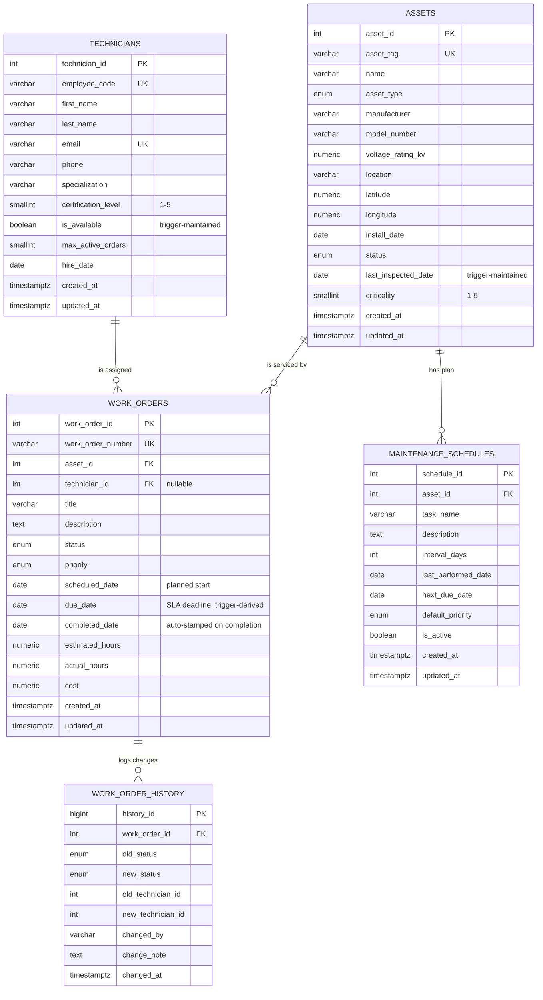

# Power Utility Asset Management — Entity Relationship Diagram (ERD)

This document describes the data model: the five tables, their columns, and the
relationships between them.

---

## 1. Entity Relationship Diagram

The diagram below uses [Mermaid](https://mermaid.js.org/) ER syntax. It renders
automatically on GitHub and in most Markdown viewers. A plain-text version
follows for environments that do not render Mermaid.



### Plain-text relationship diagram

```
                          +-------------------------+
                          |       TECHNICIANS       |
                          |-------------------------|
                          | PK technician_id        |
                          | UK employee_code        |
                          |    is_available (trig)  |
                          +-----------+-------------+
                                      | 1
                                      |
                                      | assigned to (0..N)
                                      v N
+----------------------+        +-----+----------------+        +-----------------------+
|       ASSETS         | 1    N |     WORK_ORDERS      | 1    N |  WORK_ORDER_HISTORY   |
|----------------------|--------|----------------------|--------|-----------------------|
| PK asset_id          | serviced  | PK work_order_id  | logs   | PK history_id         |
| UK asset_tag         |  by    | UK work_order_number| changes| FK work_order_id      |
|    last_inspected    |        | FK asset_id         |        |    old_status         |
|       (trigger)      |        | FK technician_id    |        |    new_status         |
+----------+-----------+        +---------------------+        +-----------------------+
           | 1
           |
           | has plan (0..N)
           v N
+----------------------+
| MAINTENANCE_SCHEDULES|
|----------------------|
| PK schedule_id       |
| FK asset_id          |
|    next_due_date     |
+----------------------+
```

---

## 2. Tables and Relationships

### 2.1 `assets`
The central entity: every physical, trackable piece of grid equipment
(transformers, breakers, lines, substations, etc.).

- **Primary key:** `asset_id`
- **Natural key:** `asset_tag` (the field-stenciled tag, unique)
- `last_inspected_date` is **not** written by hand — a trigger updates it when a
  related work order is completed.

### 2.2 `technicians`
Field crew who carry out work orders.

- **Primary key:** `technician_id`
- **Natural key:** `employee_code` (unique)
- `is_available` is **trigger-maintained** based on how many active work orders
  the technician holds versus `max_active_orders`.

### 2.3 `work_orders`
A single maintenance or repair job. This is the busiest table and the hub of the
operational model.

- **Primary key:** `work_order_id`
- **Foreign keys:**
  - `asset_id` → `assets(asset_id)` — **required**, `ON DELETE CASCADE`
  - `technician_id` → `technicians(technician_id)` — **nullable** (an open,
    unassigned order has no technician), `ON DELETE SET NULL`

### 2.4 `maintenance_schedules`
Recurring preventive-maintenance plans for an asset. `next_due_date` drives the
overdue-assets view.

- **Primary key:** `schedule_id`
- **Foreign key:** `asset_id` → `assets(asset_id)`, `ON DELETE CASCADE`

### 2.5 `work_order_history`
Append-only audit trail. Every status or assignment change on a work order
writes a row here (via a trigger).

- **Primary key:** `history_id`
- **Foreign key:** `work_order_id` → `work_orders(work_order_id)`,
  `ON DELETE CASCADE`

---

## 3. Relationship Summary

| # | Parent (one) | Child (many) | Foreign key | Cardinality | On delete | Meaning |
|---|--------------|--------------|-------------|-------------|-----------|---------|
| 1 | `assets` | `work_orders` | `work_orders.asset_id` | 1 : N | CASCADE | Each asset can have many work orders; every work order targets exactly one asset. |
| 2 | `assets` | `maintenance_schedules` | `maintenance_schedules.asset_id` | 1 : N | CASCADE | Each asset can have many recurring maintenance plans. |
| 3 | `technicians` | `work_orders` | `work_orders.technician_id` | 1 : N (optional) | SET NULL | A technician may be assigned many work orders; a work order may be unassigned. |
| 4 | `work_orders` | `work_order_history` | `work_order_history.work_order_id` | 1 : N | CASCADE | Each work order accumulates many history (audit) rows. |

**Cardinality notation:** `1 : N` means one parent row relates to zero-or-more
child rows. Relationship 3 is *optional* on the child side because
`technician_id` is nullable (backlog/open orders have no technician yet).

---

## 4. Automated Behavior (Triggers)

These keep derived columns and the audit trail correct without application code:

| Trigger | Fires on | Effect |
|---------|----------|--------|
| `trg_work_order_dates` | `work_orders` BEFORE INSERT/UPDATE | Derives `due_date` from `priority` + `scheduled_date` on insert (SLA), and auto-stamps `completed_date` with today when an order is marked `completed`. |
| `trg_asset_last_inspected` | `work_orders` INSERT/UPDATE when status becomes `completed` | Sets `assets.last_inspected_date`, restores `under_maintenance` assets to `in_service`, and advances the matching `maintenance_schedules.next_due_date`. |
| `trg_technician_availability` | `work_orders` INSERT/UPDATE/DELETE | Recomputes `technicians.is_available` from the count of active orders vs. `max_active_orders`. |
| `trg_work_order_audit` | `work_orders` INSERT/UPDATE of status or technician | Writes a row into `work_order_history`. |
| `trg_*_updated_at` | UPDATE on each table | Refreshes the `updated_at` timestamp. |

---

## 5. Views

| View | Purpose |
|------|---------|
| `vw_overdue_assets` | Assets whose active maintenance schedule is past due, ranked by an urgency score (`days_overdue × criticality`). |
| `vw_overdue_work_orders` | Active work orders past their SLA `due_date`, with `days_late` and owner, most overdue first. |
| `vw_technician_workload` | Per-technician active/completed counts, hours logged, and utilization (% of capacity). |

## 6. Stored Procedures / Functions

| Routine | Type | Purpose |
|---------|------|---------|
| `sp_create_work_order(...)` | PROCEDURE | Validates the asset, computes the order's `[scheduled_date, due_date]` window, then either (a) checks an explicitly-named technician fits that window, or (b) auto-assigns the best-fit technician. Generates a `WO-YYYY-NNNNNN` number and returns the new id + assigned technician. |
| `fn_priority_sla_days(priority)` | FUNCTION | SLA days per priority: critical 1, high 3, medium 14, low 30. |
| `fn_technician_overlap_count(tech, start, due)` | FUNCTION | Count of a technician's active orders whose window overlaps `[start, due]`. |
| `fn_technician_fits(tech, start, due)` | FUNCTION → bool | TRUE when the technician has room (overlap count < `max_active_orders`). |
| `fn_recommend_technician(start, due, specialization)` | FUNCTION | Best-fit technician for a window: least time-conflicted, then least loaded, then highest certification. |
| `fn_generate_maintenance_report(start, end)` | FUNCTION → TABLE | Per-asset summary over a date window: completed orders, open orders, total cost, hours, average resolution days. |

### Scheduling model — how dates are decided

- **`scheduled_date`** is the planned start (supplied when the order is created;
  defaults to today if omitted).
- **`due_date`** is the SLA deadline, derived as
  `scheduled_date + fn_priority_sla_days(priority)` by `trg_work_order_dates` —
  so a `critical` order is due in 1 day, `low` in 30.
- **`completed_date`** is auto-stamped with today's date the moment an order is
  marked `completed` (you can still pass an explicit date to override).
- **Assignment fit:** each active order occupies its `[scheduled_date, due_date]`
  window. A technician may take a new order only if the number of their active
  orders whose windows *overlap* the new one is below `max_active_orders`. This
  prevents double-booking across overlapping deadlines while the `is_available`
  boolean continues to reflect overall load.
